<!DOCTYPE html>
<html lang="">
<head>

</head>
<body>
  <h1>Course Commentary Project Report</h1>
  <h3>Team #9, Anusri Chavali, Maryia Sakharava,  Dylan Le</h3>
    
  <h3>Team Members Working on Proposal</h2>

Anusri Chavali:  For the project proposal, I worked on the problem/issue section, where I described the problem we are addressing with our project. I also worked on the Prior Works portion, in which I surveyed a prior work called Rate My Courses.

Maryia Sakharava: For the project proposal, I worked on the functionality of the project and the operations sections. I described what functionalities our project is going to have, and listed the specific operations that we planned on implementing.

Dylan Le: For the project proposal, I worked on the Assumptions/Operating enviroments/Usages  section as well as the diagrams. I described what our application does and how it is meant to be used.

<h3>Team Members Working on Project (Code) & Report</h3>

Anusri Chavali: On the project code, I worked on implementing the UI, connecting the various pages, displaying the reviews, and integrating the search ability. For the UI, I created a custom logo for our app on Adobe XD, and then integrated this logo into the design. For other aspects of the UI, I added layouts to the frames, connected the pages together through buttons, and added fonts and colors. I also created the page which displays the reviews and programmed the search function for the app. When a search is provided, information from the reviews.txt file, which stores all the reviews, is read into a data structure and any review which matches the search entry will be displayed in the table. I programmed the function which reads in the data and had it display the data into a table. On the report, my contribution is providing information about the project background, including the issue, describing the steps of using the code, and providing the demo images for the app. 

Maryia Sakharava: For the project code, I worked on the back-end part of the project. I implemented the sign-up and login functionalities using a text file to store the user data, and the data validation for the login (Login.java, User.java, and RegisteredUser.java). The sign-up functionality includes try catch blocks that alert the user if the password does not meet the requirements. The login functionality takes in the user email and password, and checks if the credentials match with the file. Furthermore, I implemented the basic form for writing the reviews that includes text fields, radio buttons, and a dropdown menu bar. I connected the form to another text file (reviews.txt), and when the user submits the review, it is loaded into the file (Review.java and ReviewObject.java). Other contributions to the code include fixing small bugs, editing the way the reviews are displayed in the table (wrapping the text in the table cell), and calculating the average rating and percentage of student that would take the course again statistics for each course. In the report, my contributions include the solution to the problem, and the steps to run the code.

Dylan Le: For the project code, I worked on the search ability of the project, but came up short. I was unable to create the search ability of the project on time, however Anusri was able to help do the search ability. I worked on the diagrams for the finished project. I updated every diagram to match the finished project. The initial diagrams we made influenced the final diagrams. The class diagram now shows the 19 classes that the app CourseCommentery uses. Each class on the class diagram includes variables(and the variable types) as well as the functions(and the function types). For the state diagram, I remade it to be more accurate than the last one. The home page lets you do three things; login, signup, or search. Once signed up, you are automatically logged in so the login and sign up page both lead to the review search page. You can only post when your are signed in so the diagram shows that. The sequence diagram is accurate from before so not much changed there.

<h3>Team Members Working On Presentation</h3>

Anusri Chavali: I worked on creating the presentation slides, and presented a portion of our project during the presentation. 

Maryia Sakharava: I contributed to the creation of the presentation slides, as well as going to present part of the project during the presentation.

Dylan Le: I am going to present part of the project during the presentation .

<h3>Problem</h3>

Many SJSU students rely on Rate my Professors when registering for classes in order to gain more information on the professors and courses they will take in the upcoming semester. However, students can run into issues when professors are not announced at the time of registration, or there is turnover of the faculty teaching a specific course. In these circumstances, they might not know where to look in order to receive more student-based information about the courses they plan to take. The solution we propose, Course Commentary, is a review system that is organized by course rather than professor. Since courses are more constant factors than professors teaching the course, students will always be able to access information about the courses they plan to take, giving them insight on how their next semester will go.

<h3>Previous Works</h3>

https://www.ratemycourses.io/sjsu An existing solution to the issue is a website called Rate my Courses for SJSU. There are some issues with it that our website would resolve. For one thing, this website is not very updated, so many courses have no information. We would try to provide a course description for every class so at least some information is available for everything. Next, the website’s review system still links to a professor. This leads to the issue of professor turnover or lack of professor information at registration time. In our solution, the review template provided by our desktop app is more course specific, and the professor is just listed as part of the review. The rating of the course and whether they would take the class again is also an option for the review, and the data over reviews are compiled and displayed for each course. 

<h3>Assumptions/Operating Environments/Usages</h3>

The website is designed for SJSU students who are looking to register for classes, however, they want to learn more about the course from the previous student before they register. Users will be able to access this website from their desktop, as this is a desktop application rather than a web application. Students will be able to use this app in order to see reviews posted about specific courses at SJSU. They can input courses in the search bar in order to see the individual reviews as well as some stats regarding the course in general.  This application can be upsized to work for every college. The intended usage is for the user to open the app on the desktop. Once the application is open on the home page they can either sign up, login, or search for a review. If they choose to login, users will have to input email address and password to login. If the login is invalid then the application will say so, but if it is valid then the user will be logged in.If they choose to sign up then they will be presented the sign up screen. On that screen there will be sections for them to fill out; first name, last name, email address, password. Once signed up, users are automatically logged in. Users can only write reviews when they are logged in. If the user chooses to search they will enter a course name into the search bar and press the search button. Once the search button is pressed, the reviews matching whatever the user entered will be displayed in a long list. Those reviews will also show an average rating for the course searched. If the user enters in a course that returns no searches, then a popup will tell the user that there were no results found and then the user can search again. 

<h3>Diagrams</h3>

https://drive.google.com/file/d/1GRVhliNU5P6K4D7Cc07kRSe1ut9bM7Ot/view?usp=sharing

<h3>Functionality</h3>

Our solution tackles the issue of inconsistent or missing information at the time of registration. Rate my professor is a solution that provides professor-specific information, but professors are not always known at registration time, or the professor’s review for a specific course is not always provided. By organizing reviews by course, students will always have access to information about courses they need to take, regardless of variable factors such as the professor teaching the course, whether the course is required, the difficulty of the course, and so on. This is also a more organized structure because students can look at their myPlanner and then go to the website to read reviews about courses they plan to enroll in. Not only will this provide more organization and information, but it will also help them make their decision about what courses to take. 

<h3>Operations</h3>

Student viewer (does not require an account):
Look up the course
View reviews filtered by search
Create an account

Student registered user (requires an account):
Log in
Log out
Write a review
All the operations that do not require an account

</body>
</html>

<h3>Solutions</h3>

This project offers a solution to the problem of students not being able to view course reviews before registration unless they know the name of the professor. With our project, students can search for a specific course number and access reviews for that course. The reviews include the professor's name, student comments, a rating on a scale of 1 to 10, whether the student would take the course again, and whether there are any required textbooks. The solution is designed with the purpose of making the planning of the next semester easier without having to know what professor is teaching the course. 

<h3> Steps to Run the Code</h3>

Import the project into an IDE with java installed  
 

Build 

Run Controller class

<h3>Demo Snapshots</h3>

Home page when app is first opened

Login page for existing users

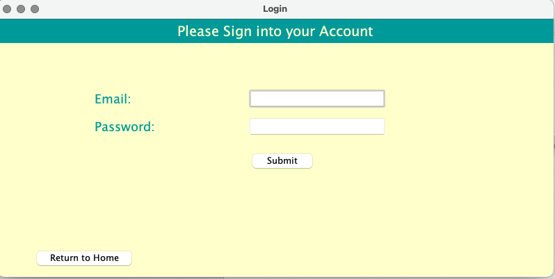

Login screen when account is not found

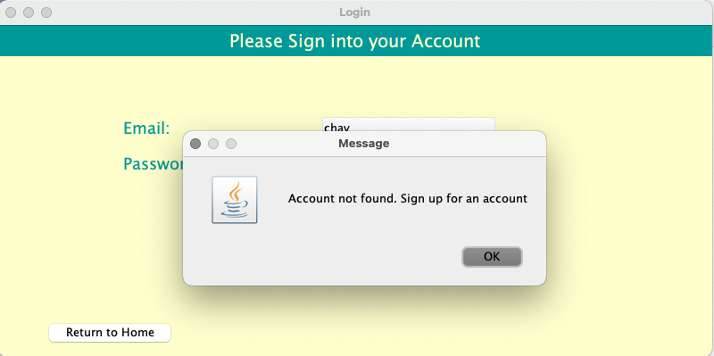

Login screen when password is not found

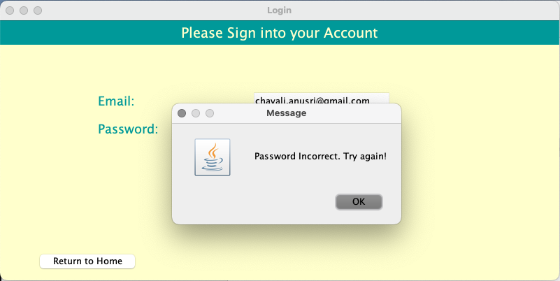

Login screen for a successful login

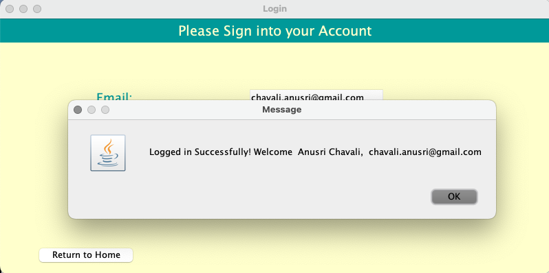

Home screen for a registered user – contains a write review and log out button

Pop up which is shown when a search entry has no associated reviews

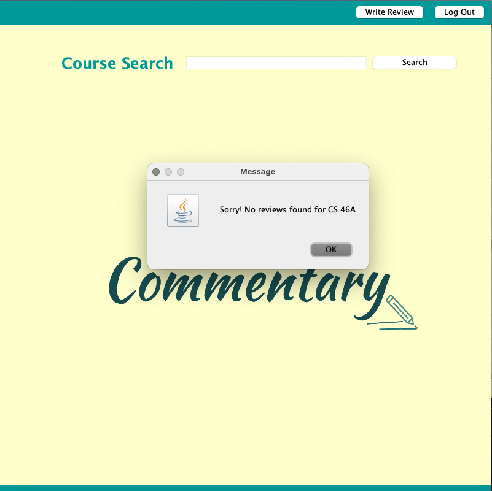

Reviews display for search entry: CS 151

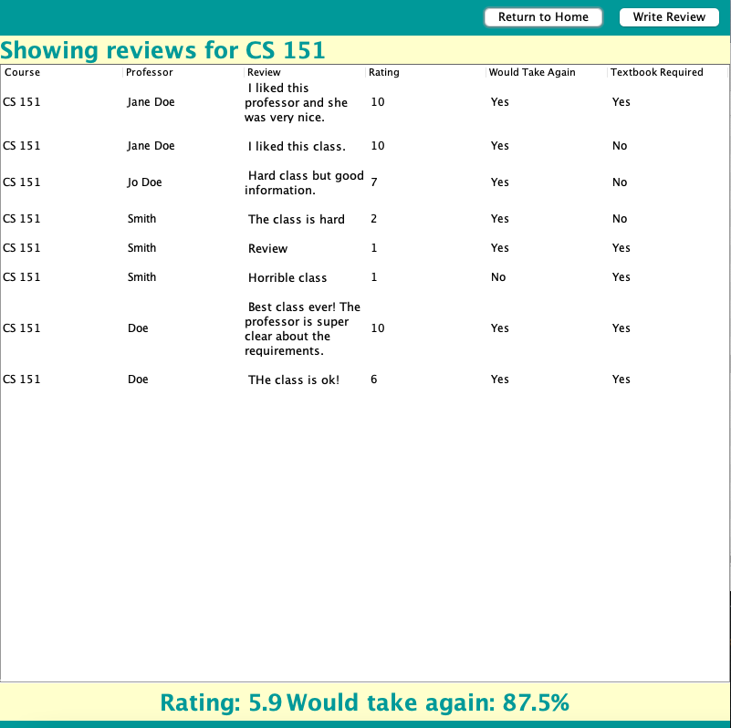

Page to write review

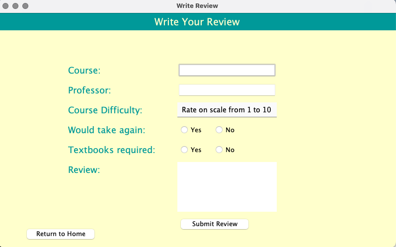

Menu for course difficulty rating

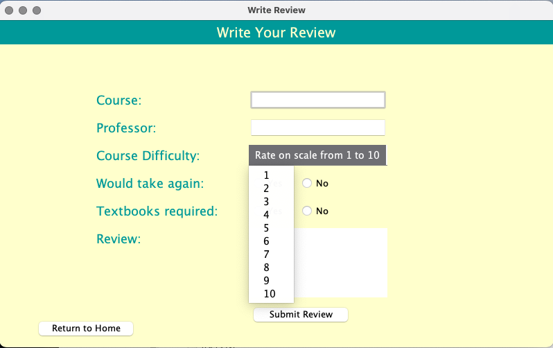

Pop up which is shown when a review is successfully posted

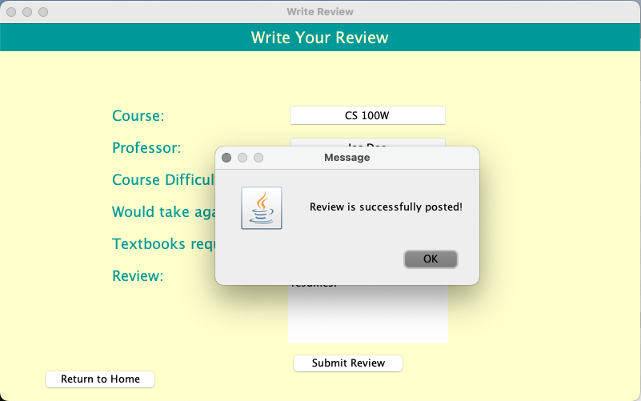

Signup page and various popups related to unsuccessful sign up

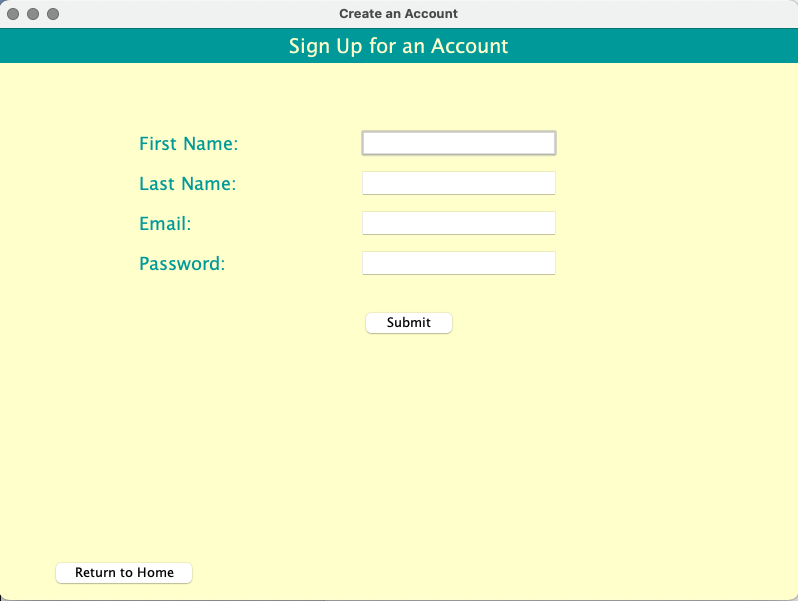
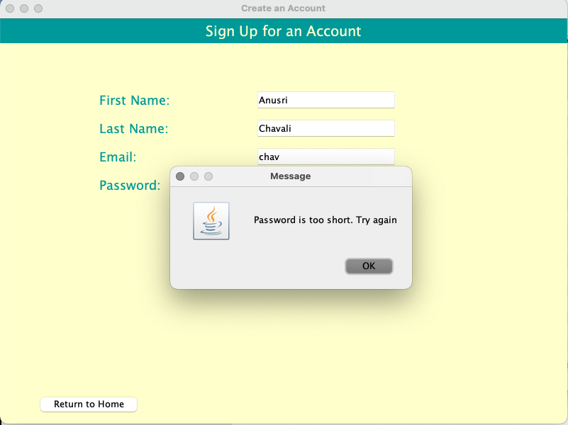
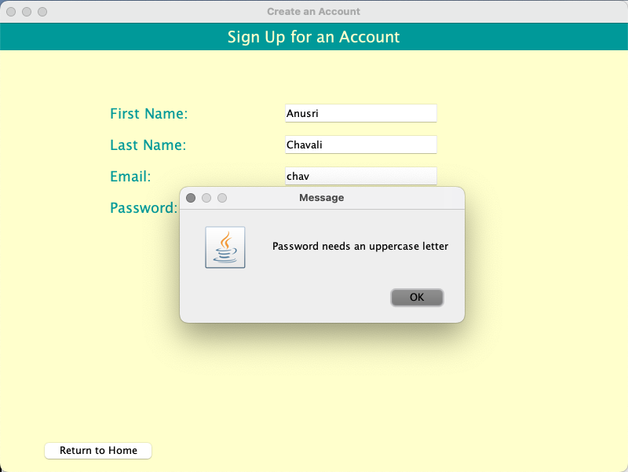
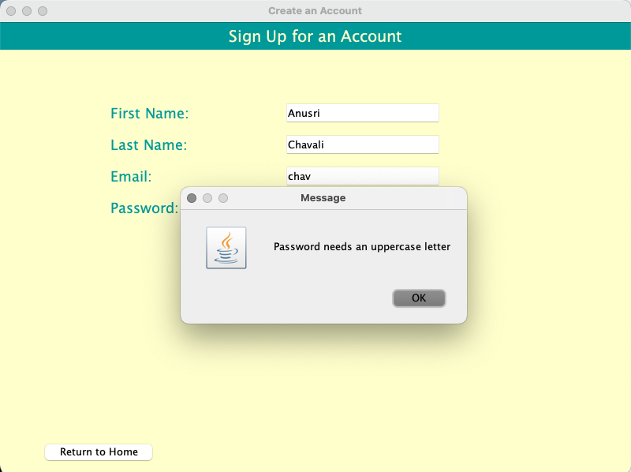
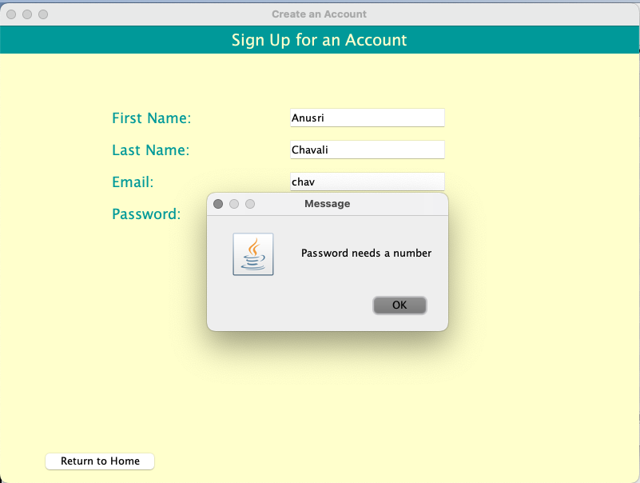

Successful Signup

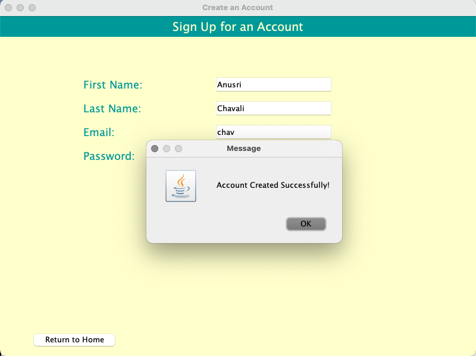

